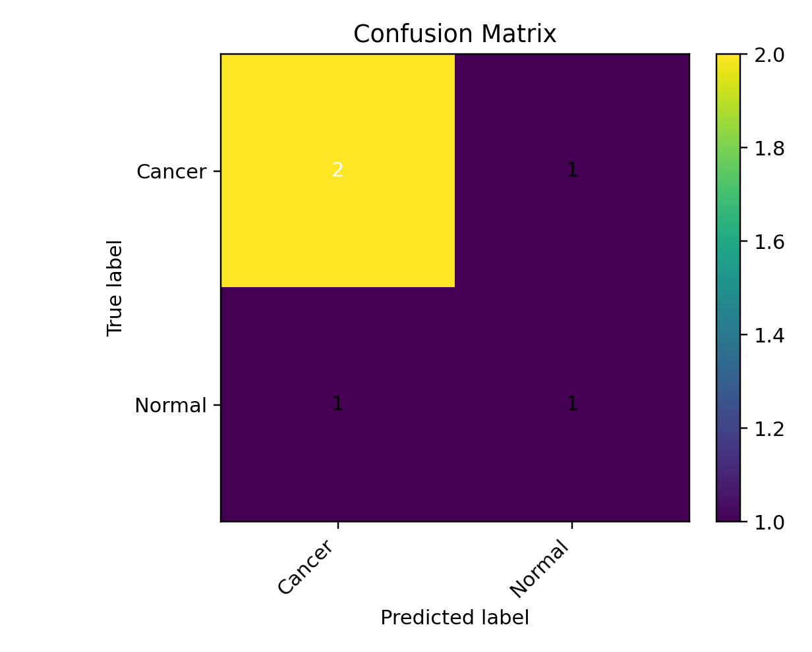

# 🦴 Bone Cancer Detection (Normal vs Cancer)

A deep learning pipeline to classify **bone images** as **Normal** or **Cancer**.  
Built with **TensorFlow/Keras**, the project uses CNN-based image classification trained on your dataset.  

---

## 📂 Dataset

Your dataset structure:

Bone Cancer Detection/
└── archive/
└── Research dataset/
├── Normal/ # normal bone images
├── Cancer/ # cancer bone images
└── Test/ # unseen test images for prediction

markdown
Copy code

- **Normal/** → healthy bone pictures  
- **Cancer/** → bone cancer pictures  
- **Test/** → images to check predictions  

---

## 🚀 Features

- Preprocesses and splits dataset (train/val/test)  
- CNN-based binary classifier (Normal vs Cancer)  
- Data augmentation for robustness  
- Saves model + artifacts:  
  - `bone_cancer_cnn.h5` → trained model  
  - `label_encoder.pkl` → class encoder  
  - `history.json` / `history.csv` → training logs  
  - `metrics.json` → test metrics (accuracy, precision, recall, F1, AUC)  
  - `classification_report.txt` → detailed test results  
  - Graphs:  
    - `accuracy_curve.png`  
    - `loss_curve.png`  
    - `confusion_matrix.png`  
    - `roc_curve.png`  
  - Predictions CSV:  
    - `test_predictions.csv` → true vs predicted labels on test set  
    - `predictions_on_test_dataset.csv` → predictions on unseen `Test/` folder  

---

## ⚙️ Installation

1. Create and activate a virtual environment:

```bash
python -m venv .venv
.\.venv\Scripts\activate
Install dependencies:

bash
Copy code
pip install --upgrade pip
pip install "tensorflow>=2.10" numpy pandas scikit-learn pillow matplotlib seaborn pyyaml
🏋️ Training
Run training script:

bash
Copy code
python train_bone_cancer_cls.py
Artifacts are saved to:

makefile
Copy code
C:\Users\NXTWAVE\Downloads\Bone Cancer Detection\artifacts\
📊 Visualization
Accuracy Curve & Confusion Matrix
Run:

bash
Copy code
python show_results.py
This will:

Show and save accuracy_curve_manual.png

Show and save confusion_matrix_heatmap.png

🔍 Predictions
Predict on Entire Test Folder
bash
Copy code
python predict_bone_cancer.py
Output → artifacts/predictions_on_test_dataset.csv

Columns:

path → image file path

pred_label → predicted class (Normal/Cancer)

pred_prob_cancer → probability of cancer class

Predict a Single Image
bash
Copy code
python predict_single.py
By default, it predicts:

swift
Copy code
archive/Research dataset/Cancer/3.jpg
Output:

mathematica
Copy code
=== Prediction Result ===
Image : C:\...\Cancer\3.jpg
Predicted Label : Cancer
Probability (Cancer class=1) : 0.9821
You can change IMG_PATH inside predict_single.py to test other images.

📈 Results
Accuracy, precision, recall, F1, AUC reported on held-out test set.

Confusion matrix and ROC curve saved for better analysis.

🧭 Notes
Adjust IMG_SIZE (default 224) or model layers in train_bone_cancer_cls.py if you want more accuracy.

For faster training and higher accuracy, you can switch to transfer learning (e.g., EfficientNetB0).

Add Grad-CAM visualizations to highlight image regions contributing to predictions.

📌 Project Files
train_bone_cancer_cls.py → training + evaluation

show_results.py → accuracy/loss/heatmap

predict_bone_cancer.py → predictions on Test/ dataset

predict_single.py → predict one image

artifacts/ → all saved outputs

👤 Author
Developed by Sagnik Patra
